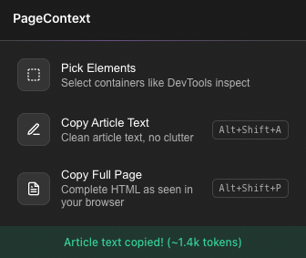

# PageContext

Copy what you see in your browser, paste it into any LLM.

LLMs can fetch public URLs, but they can't get past bot protection or see anything behind a login. PageContext grabs the content straight from your browser tab and puts it on your clipboard in a clean, paste-ready format.

## Features

- **Pick Elements**: hover and click to select specific containers on the page (like DevTools inspect mode), then copy their cleaned HTML.
- **Copy Article Text**: extract the main article using Mozilla's Readability.js. Copies as markdown with the title and byline.
- **Copy Full Page**: copy the entire page's HTML with scripts, styles, iframes, and SVGs stripped out.

No build step, no external dependencies, no data sent anywhere. Everything runs locally in your browser.

## Install

PageContext is not on the Chrome Web Store yet. To install it locally:

1. Clone this repository.
2. Open `chrome://extensions` in Chrome.
3. Enable "Developer mode" in the top right.
4. Click "Load unpacked" and select the project folder.

The PageContext icon appears in your toolbar. Click it to open the popup.

## Usage

Open the popup and pick one of the three actions. The result is copied to your clipboard.

### Pick Elements

Click "Pick Elements" to enter inspect mode. Hover over elements to preview them, click to select. Click a selected element again to deselect it. Use "Copy Selected" to copy all selected elements, or "Clear All" to reset.

### Keyboard shortcuts

Two actions have global shortcuts that work without opening the popup:

| Action | Shortcut |
|---|---|
| Copy Article Text | `Alt+Shift+A` |
| Copy Full Page | `Alt+Shift+P` |

Customize these at `chrome://extensions/shortcuts`.

## License

MIT. See [LICENSE](LICENSE).

Readability.js is vendored from [@mozilla/readability](https://github.com/mozilla/readability) under the Apache 2.0 license.
